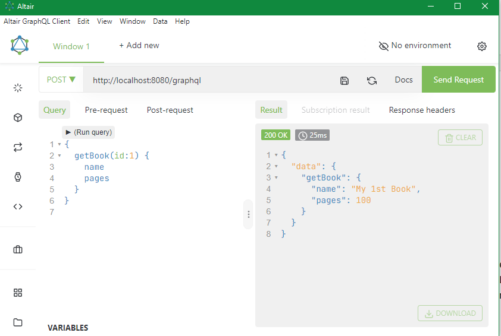
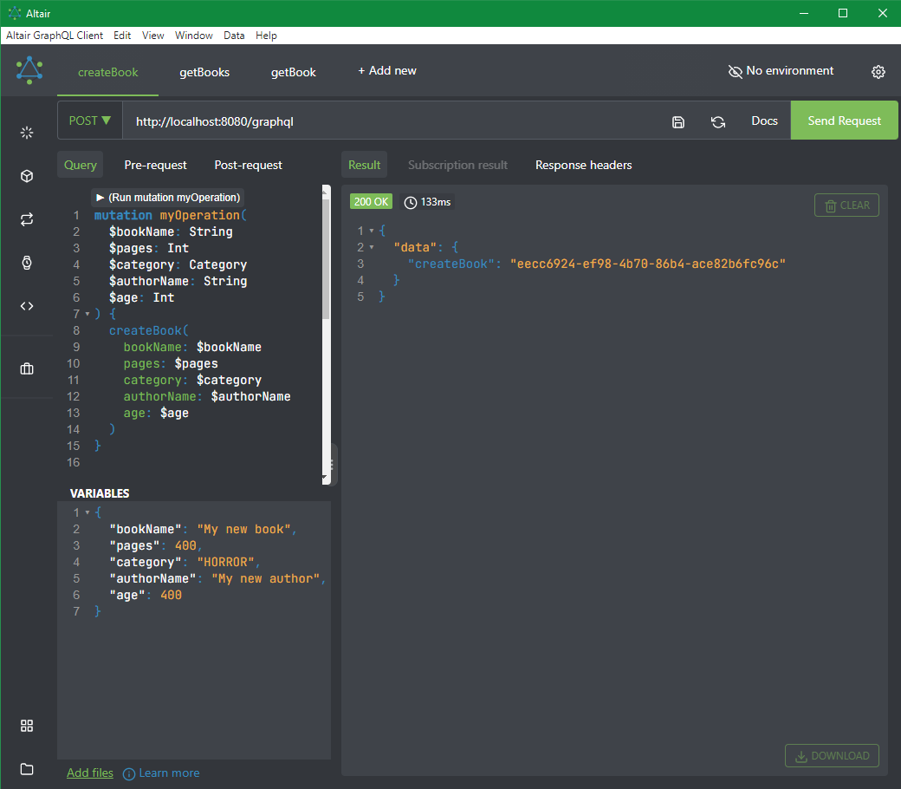

# GraphQL Spring Boot

## Set up

```
<dependency>
    <groupId>com.graphql-java</groupId>
    <artifactId>graphql-java</artifactId>
    <version>15.0</version>
</dependency>
```

```
<dependency>
    <groupId>com.graphql-java</groupId>
    <artifactId>graphql-java</artifactId>
    <version>17.3</version>
</dependency>
```

## Knowledge Points

### Java

```
ConnectionFactoryInitializer
ResourceDatabasePopulator
DatabaseClient -> R2dbcEntityTemplate
Criteria
SchemaParser
ClassPathResource
TypeDefinitionRegistry
RuntimeWiring
TypeRuntimeWiring
SchemaGenerator
GraphQLSchema
CompletableFuture
Mono
Flux
```

### H2

```
DROP TABLE IF EXISTS ...
CREATE TABLE IF NOT EXISTS ...
```

### Tool

```
Altair
```

Postman can be used for GraphQL!

## Screenshot








