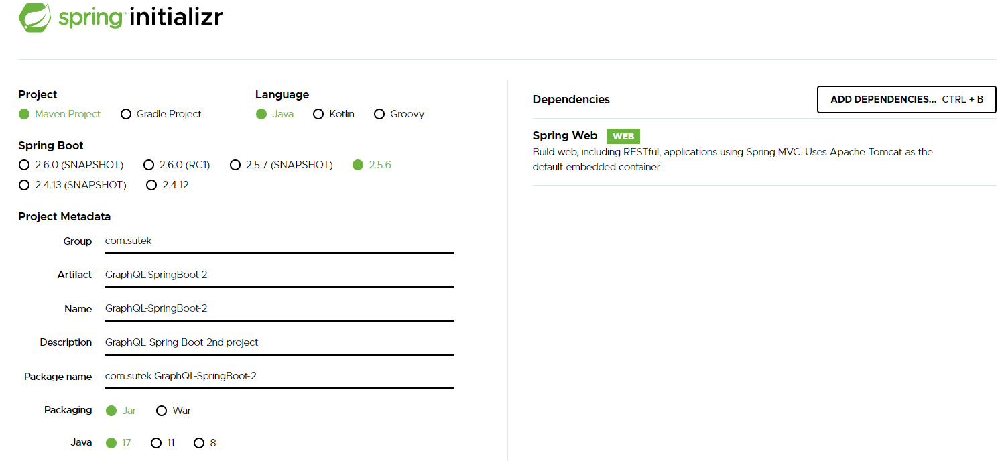
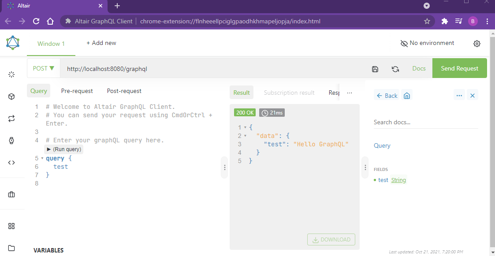
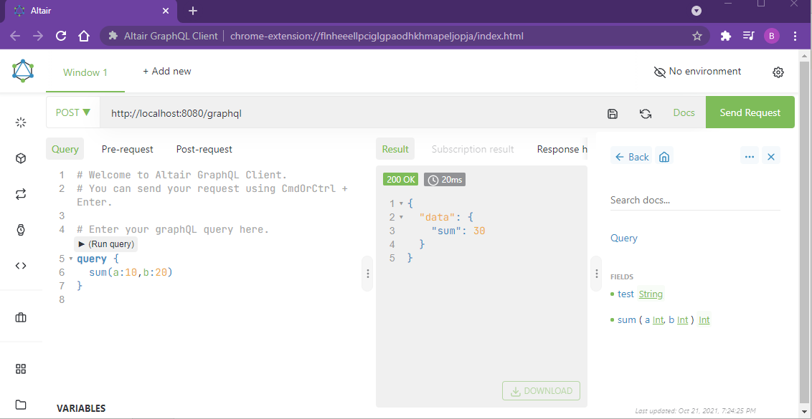

# GraphQL Spring Boot

## Set up

```
<dependency>
    <groupId>com.graphql-java</groupId>
    <artifactId>graphql-spring-boot-starter</artifactId>
    <version>5.0.2</version>
</dependency>
<dependency>
    <groupId>com.graphql-java</groupId>
    <artifactId>graphql-java-tools</artifactId>
    <version>5.2.4</version>
</dependency>
<dependency>
    <groupId>com.graphql-java</groupId>
    <artifactId>graphiql-spring-boot-starter</artifactId>
    <version>5.0.2</version>
</dependency>
```

## Spring related

### .graphqls

### GraphQLQueryResolver

### GraphQLResolver

### GraphQLMutationResolver

## Knowledge Points

### Chrome extensions

```
Altair GraphQL Client
GraphQL developer tools
ChromeiQL
```

### GraphiQL vs GraphQL

UI

### Query

### Mutation

### Resolver

### Subscription

#### PubSub

#### graphql-subscriptions

Package to use for pub/sub handling.

#### subscriptions-transport-ws

Package used to transport pub/sub connections over web-socket

DAO
Java bean

## Screenshot






