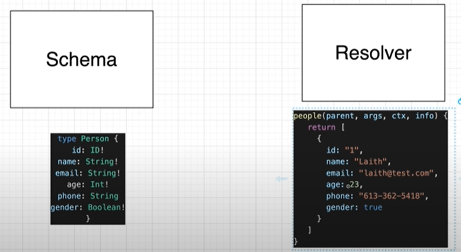
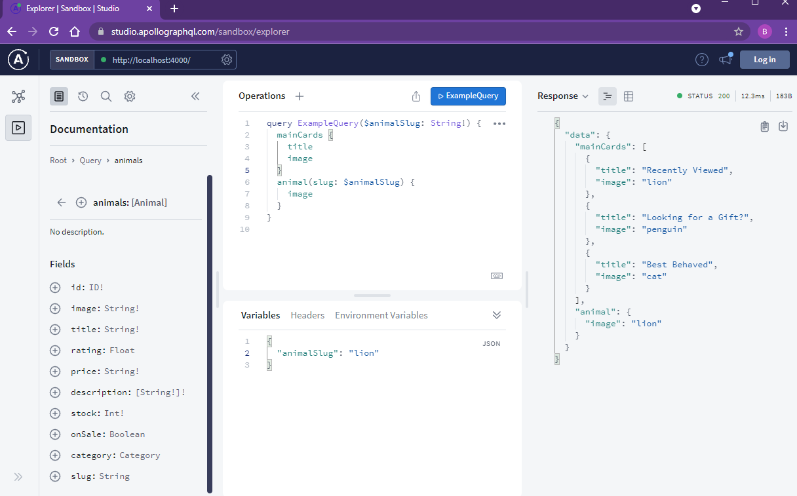
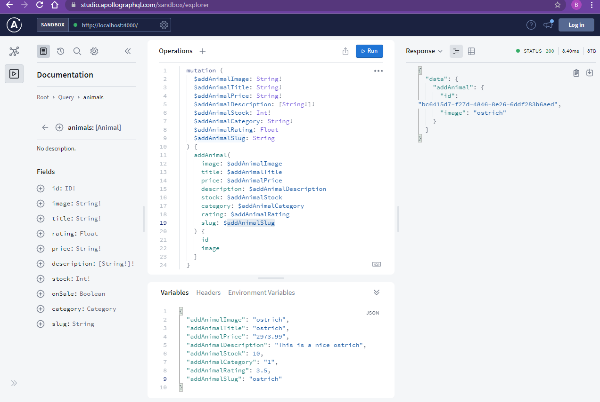
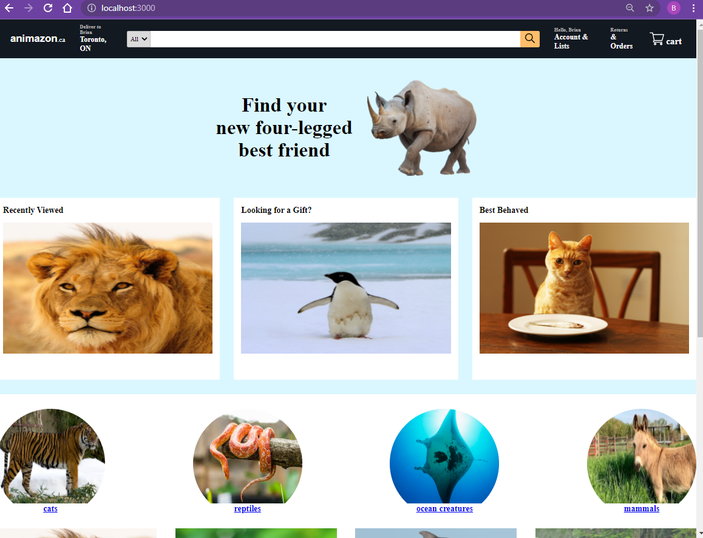
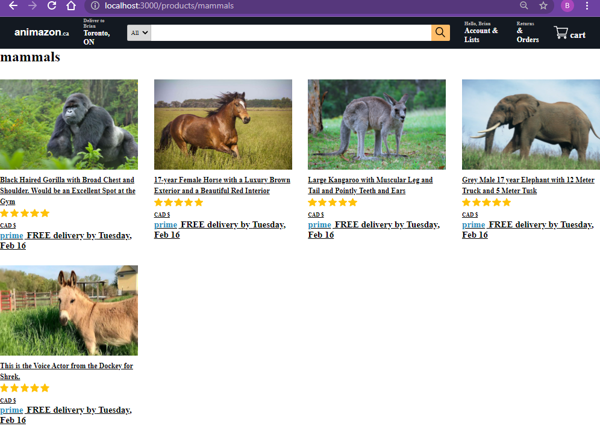
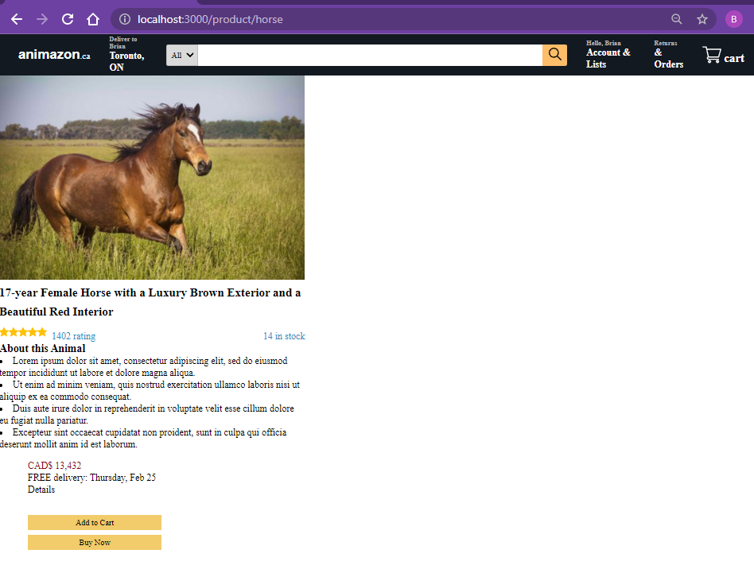

# Simple GraphQL

## Set up

### Server

```
npm init --yes
npm install apollo-server graphql
```

### Client

```
npx create-react-app my-app
npm install @apollo/client graphql
```

## Knowledge Points

```
Apollo Server
Apollo Sandbox
Apollo Studio
Apollo Client
```

```
parent, args, ctx, info

const FETCH_MAIN_CARDS = gql`
  query {
    mainCards {
      image
      title
    }
  }
`;

const { loading, error, data } = useQuery(FETCH_MAIN_CARDS);

      <button
        onClick={() => {
          addAnimal({
            variables: {
              addAnimalImage: "ostrich",
              addAnimalTitle: "This is a really cool ostrich",
              addAnimalPrice: "9768.99",
              addAnimalDescription: "Nice",
              addAnimalStock: 100,
              addAnimalCategory: "1",
              addAnimalRating: 4.3,
              addAnimalSlug: "mammals",
            },
          });
        }}
      >
        Add an Ostrich
      </button>

const ADD_ANIMAL_MUTATION = gql`
  mutation (
    $addAnimalImage: String!
    $addAnimalTitle: String!
    $addAnimalPrice: String!
    $addAnimalDescription: [String!]!
    $addAnimalStock: Int!
    $addAnimalCategory: String!
    $addAnimalRating: Float
    $addAnimalSlug: String
  ) {
    addAnimal(
      image: $addAnimalImage
      title: $addAnimalTitle
      price: $addAnimalPrice
      description: $addAnimalDescription
      stock: $addAnimalStock
      category: $addAnimalCategory
      rating: $addAnimalRating
      slug: $addAnimalSlug
    ) {
      id
      image
    }
  }
`;

const [addAnimal] = useMutation(ADD_ANIMAL_MUTATION);

```

## Screenshot

### Design



### Query



### Mutation - Add an animal



### Client app - home



### Client app - category



### Client app - item


