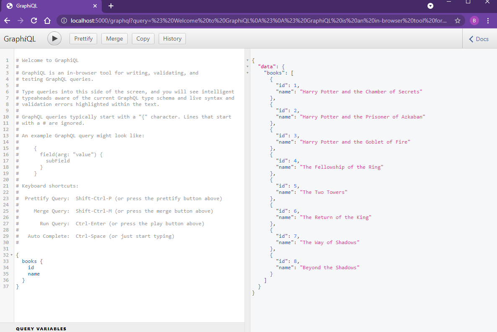
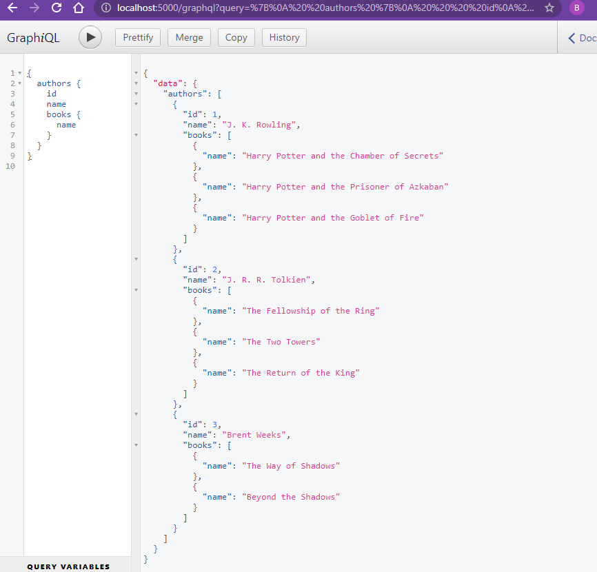
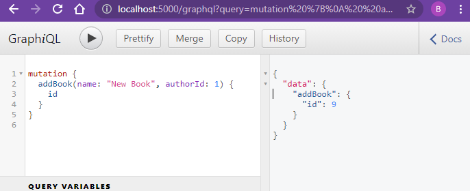
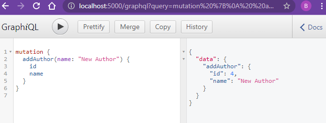

# Simple GraphQL

## Set up

```
npm init -y
npm i express express-graphql graphql nodemon
npm run start
```

## Knowledge Points

```
Express GraphQL Server
```

```
GraphQLSchema
GraphQLObjectType
GraphQLString
GraphQLInt
GraphQLList
GraphQLNonNull
```

## Screenshot

### Query - Books



### Query - Authors & Books



### Mutation - Add a Book



### Mutation - Add an Author


